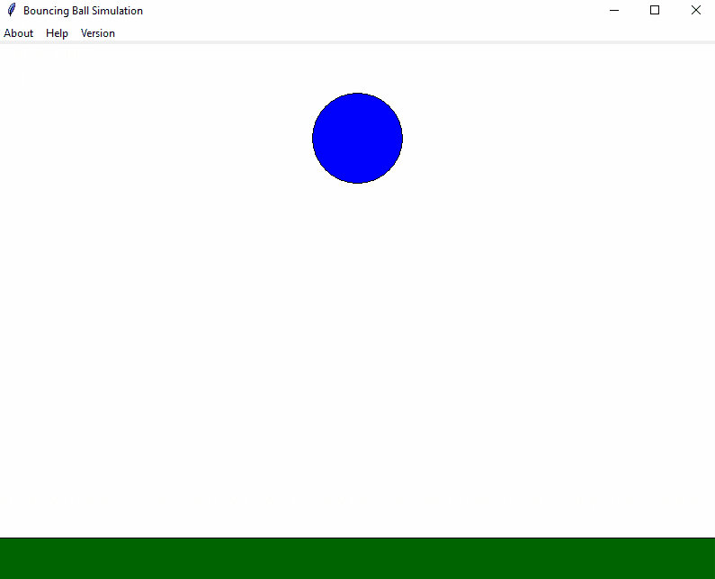

# Elastic Ball Physics Simulation

 

[](https://github.com/maunest/elastic-ball-physics-simulation/releases)

[](https://github.com/maunest/elastic-ball-physics-simulation/actions/workflows/app.yml)
[](https://i6.otzovik.com/2017/07/29/5190608/img/7789362.jpeg)
---
Программа "Elastic Ball Physics Simulation" представляет собой приложение,
моделирующее движение мяча, отскакивающего от зоны на экране. 

Приложение написано на языке Python с использованием библиотеки Tkinter для создания графического интерфейса.


Приложение разработано по следующему заданию:
> Требуется составить программу демонстрирующую: Процесс падения упругого шарика с заданной высоты на
> абсолютно твердую горизонтальную плоскость с последующими отражениями. Коэффициент отражения равен k.
> Программа должна завершаться по нажатию клавиши ESC или когда высота поднятия отскакивающего шарика
> станет меньше заданной величины h.

## Демонстрация приложения

---


## Как установить

---

```cmd
git clone git@github.com:maunest/elastic-ball-physics-simulation.git

install python

pip install tk
```


## Как использовать

---
Открыть терминал в исходной папке проекта и выполнить следующую команду:
```cmd
python main.py
```

После запуска, вы увидите окно, моделирующее движение мяча . Используйте пункты меню сверху или следующие клавиши:

1) Escape(ESC): Закрыть приложение.

## Лицензия

---

Этот проект лицензирован в соответствии с условиями лицензии [MIT](LICENSE.md).


## Автор

---

- **maunest**
  - GitHub: [maunest](https://github.com/maunest)
  - Электронная почта: max.hairulov@mail.ru

